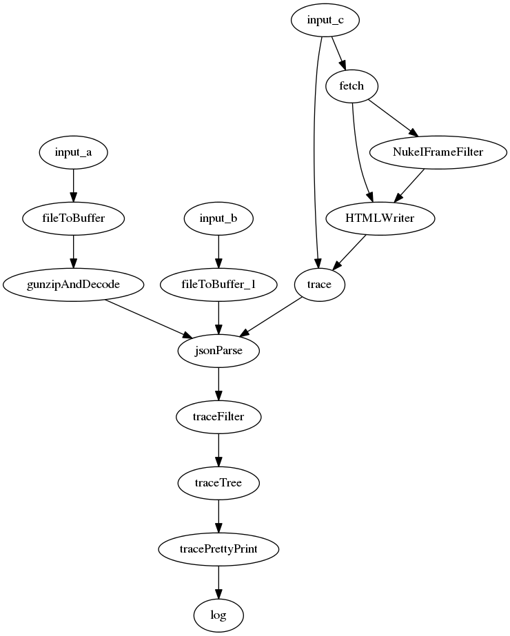

# Erlnmyr

The Builder of Tree Builders

## Quick Start Guide

### Installing all the bits

1.  Install git
2.  Grab the source code:
    `git clone https://github.com/GoogleChrome/erlnmyr.git`
3.  Install node.js from https://nodejs.org/download/
4.  `cd erlnmyr`
5.  `npm install`
6.  (optional) Install gulp globally so it'll be on your path:
    `sudo npm install -g gulp`
7.  (optional) if you want to be able to run automated perf tests or easily
    extract DOM from URLs, check out a chromium tree 
    (http://dev.chromium.org/developers/how-tos/get-the-code). Note that you
    don't need to build chromium, just check it out.

### Saving the DOM of web pages

If you have a local chromium checkout, and assuming that it's installed at /path/to/chromium:

`gulp get --url="http://example.com/my-super-exciting-DOM.html" --chromium=/path/to/chromium --saveBrowser=system`

This will save the DOM content of the provided url in a result.json file.

If you don't have a local chromium checkout, you can still save pages by
navigating to them in Chrome, opening dev tools, and dumping the contents
of `save.js` into the console.

### Converting DOM to HTML or JS

To save an HTML file (result.html.html)

`gulp html --file=result.json`

To save a JS file (result.js.html)

`gulp js --file=result.json`

### Dumping Stats about DOM

`gulp stats --file=result.json`

### Measuring DOM performance

You'll ned a local chromium checkout. You'll also need adb if you want to run perf tests on a rooted Android device.

`gulp perf --url=http://example.com --chromium=/path/to/chromium --perfBrowser=system`

or

`gulp perf --url=http://example.com --chromium=/path/to/chromium --adb=/path/to/adb --perfBrowser=android-jb-system-chrome`

Note that this will measure load performance of the live page. If you want to dump just the DOM content
and measure that instead, use:

`gulp endToEnd --url=http://example.com --chromium=/path/to/chromium --perfBrowser=system --saveBrowser=system`

or, to perf test on Android:

`gulp endToEnd --url=http://example.com --chromium=/path/to/chromium --adb=/path/to/adb --perfBrowser=android-jb-system-chrome --saveBrowser=system`

## Recorder Format

Base format is JSON of an array: `[]`.

Every item in this array is an object: `[{}, {}, ...]`.

Every object needs to have a property `t`, which represents the type of the object:
`[{'t': ...}, {'t': ...}, ...]`.

Other properties of the object depend on the value of `t`:

`[{'t':'n', 'v':'img'}, {'t':'a', 'n':'src', 'v':'foo.jpg'}, ...]`.

Here are all known values of `t`:

* `b` -- URL base for the stream of tokens. Expected other properties: 
  * `v` -- the base url
* `a` -- tag attribute. Expected other properties:
  * `n` -- name of the attribute
  * `v` -- value of the attribute
* `n` -- opening tag. Expected other properties: 
  * `n` -- name of the tag
* `/` -- closing tag
* `t` -- text. Expected other properties:
  * `v` -- text value
* `c` -- comment. Expected other properties:
  * `v` -- comment value

## Experiments

Using an experiment, you can set up a tree of filters and writers, along with
filename regular expressions to control input and output.  This lets you
perform complicated processing steps in the same way across a large number of
files.

Experiments can be used in two ways: via an experiment file (and the prerolled
gulp runExperiment target), or by using the experimentTask function in
gulpfile.js to directly register an experiment data structure.

### Experiment Files

trace.dot contains an example experiment. Experiments are just dot files
(http://www.graphviz.org/Documentation.php). In particular, this means you
can do this to visualize your experiment:

```
dot -Tpng experiment.dot -o experiment.png
```

Each node in the dot graph is a processing phase. Edges represent data flow
between phases. Looking at the main parts of trace.dot:

```
input -> readDir -> fork -> fileToBuffer -> gunzipAndDecode -> jsonParse;
jsonParse -> traceFilter -> tracePIDSplitter -> traceTIDSplitter -> traceTree;
traceTree -> tracePrettyPrint -> log;
```

This defines a single long chain of processing steps, starting at input and
moving through file reading (readDir, fileToBuffer, gunzipAndDecode), parsing
(jsonParse), trace file filtering and processing (traceFilter, tracePIDSplitter,
traceTIDSplitter, traceTree), and logging (tracePrettyPrint, log).

Each processing step can be configured:

```
input [data="traces"]
log [tags="['filename']"]
traceFilter [traceEvents="['Document::updateStyle','V8.Execute','CSSParserImpl::parseStyleSheet']"];
tracePrettyPrint [showTrace="false"];
```

Once you have an experiment defined, you can run it with:

```
gulp runExperiment --file=<experiment-file>
```

And basically, that's it!

#### More fun with experiments

Sometimes, you want to do the same thing to a bunch of different inputs, or feed
the same input into multiple processing paths. Using a graph as input makes this
simple:

```
digraph experiment {
  input_a -> fileToBuffer -> gunzipAndDecode -> jsonParse;
  input_b -> fileToBuffer_1 -> jsonParse;
  input_c -> trace -> jsonParse;
  input_c -> fetch -> HTMLWriter -> trace;
  fetch -> NukeIFrameFilter -> HTMLWriter;

  jsonParse -> traceFilter -> traceTree -> tracePrettyPrint -> log;
}
```



## License

Copyright 2015 Google, Inc.

Licensed to the Apache Software Foundation (ASF) under one or more contributor license agreements. See the NOTICE file distributed with this work for additional information regarding copyright ownership. The ASF licenses this file to you under the Apache License, Version 2.0 (the “License”); you may not use this file except in compliance with the License. You may obtain a copy of the License at

http://www.apache.org/licenses/LICENSE-2.0

Unless required by applicable law or agreed to in writing, software distributed under the License is distributed on an “AS IS” BASIS, WITHOUT WARRANTIES OR CONDITIONS OF ANY KIND, either express or implied. See the License for the specific language governing permissions and limitations under the License.